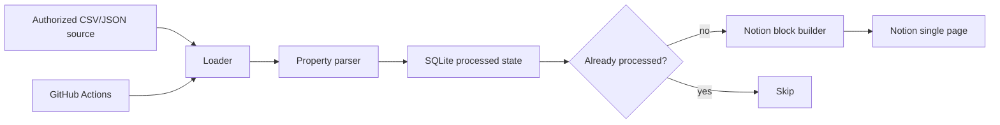

# Facebook Group Notion Property Logger

Facebookグループの物件投稿を、許可済みデータソースから読み込み、投稿URL・本文・抽出した物件情報をNotionの**単独ページ**へ追記するPythonスクリプトです。

> 重要: このリポジトリは、Facebookの画面を自動操作して「人間っぽく見せる」スクレイピングや検知回避を行いません。MetaのGroups APIはv19.0で非推奨化され、2024-04-22以降は全バージョンから削除されたため、現在はグループ投稿の直接API取得を前提にしていません。代わりに、利用権限のあるCSV/JSON、社内で許可されたエクスポート、または正規に取得した投稿データを入力にします。

## できること

- CSV/JSONの投稿データを読み込み
- 投稿URL、本文、投稿日時、投稿者、添付URLをNotionページへ追記
- 家賃・価格、所在地、最寄駅、間取り、面積などを簡易抽出
- SQLiteで処理済み投稿を記録し、重複追記を防止
- GitHub Actionsでテスト、dry-run、手動/定期実行
- Codespaces/devcontainerで即実行できる開発環境

## できないこと

- Facebookログイン画面やグループ画面の自動ブラウザ操作
- CAPTCHA、レート制限、Bot検知、利用規約制限の回避
- 権限のないグループ、非公開投稿、第三者投稿の無断取得

## 入力形式

### JSON

```json
{
  "posts": [
    {
      "id": "sample-001",
      "post_url": "https://www.facebook.com/groups/1281008662437696/posts/1234567890/",
      "content": "東京都渋谷区、1LDK、賃料18万円、45㎡、渋谷駅徒歩8分。内見可。",
      "created_time": "2026-06-16T09:00:00+09:00",
      "author": "Example Agent",
      "attachments": ["https://example.com/property/123"]
    }
  ]
}
```

### CSV

```csv
id,post_url,content,created_time,author
sample-001,https://www.facebook.com/groups/1281008662437696/posts/1234567890/,東京都渋谷区 1LDK 賃料18万円 45㎡ 渋谷駅徒歩8分,2026-06-16T09:00:00+09:00,Example Agent
```

## ローカル実行

```bash
python -m venv .venv
source .venv/bin/activate
pip install -e '.[dev]'
python -m fb_notion_property_logger sync --source data/sample_posts.json --dry-run
```

Notionへ実際に追記する場合:

```bash
export NOTION_TOKEN='secret_xxx'
export NOTION_PAGE_ID='xxxxxxxxxxxxxxxxxxxxxxxxxxxxxxxx'
python -m fb_notion_property_logger sync --source data/sample_posts.json
```

## GitHub Actionsで自動実行

1. GitHub repository settingsでSecretsを追加します。
   - `NOTION_TOKEN`: Notion integration token
   - `NOTION_PAGE_ID`: 追記先NotionページID
2. 入力ファイルを `data/import/posts.json` または `data/import/posts.csv` に置きます。
3. Actionsの `Property logger CI` workflow を手動実行します。
   - `run_live=true` のときだけNotionに追記します。
   - schedule実行時もSecretsと入力ファイルが揃っていれば自動同期します。

## Mermaid architecture



## 主要コマンド

```bash
# dry-run
python -m fb_notion_property_logger sync --source data/sample_posts.json --dry-run

# 結果JSONを保存
python -m fb_notion_property_logger sync --source data/sample_posts.json --dry-run --output out/result.json

# 処理済み状態を初期化して再処理
python -m fb_notion_property_logger sync --source data/sample_posts.json --dry-run --reset-state
```

## 本番運用に必要なもの

- Notion integration token
- 追記先NotionページID
- Facebook投稿データを取得する正当な入力元
- GitHub Actionsで使う場合はGitHub Secrets
- 取り込み対象のCSV/JSONを更新する運用

詳細は [`docs/setup.md`](docs/setup.md) と [`docs/architecture.md`](docs/architecture.md) を参照してください.
