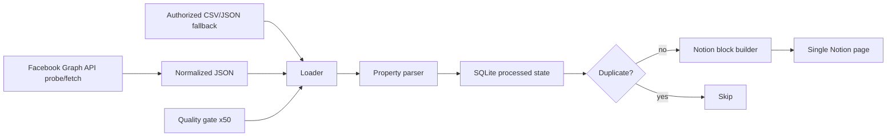

# Facebook Group Notion Property Logger

Facebookグループの物件投稿を、安定的・監査可能・非回避的な方法でNotionの**単独ページ**へ記録するPythonプロジェクトです。

対象グループ:

```text
https://www.facebook.com/groups/1281008662437696
```

## 方針

- まず公式Graph APIで対象グループIDの取得可否を検査します。
- Graph APIで取れる場合はページングで投稿を取得し、JSONに正規化します。
- Graph APIが権限・仕様・廃止状況により使えない場合は、権限のあるCSV/JSON入力を使います。
- Notionには1ページへ追記します。
- SQLiteで処理済み投稿を記録し、重複追記を防ぎます。
- テストは外部ネットワークに依存せず、50回反復できる品質ゲートを用意しています。

## 重要な制約

このリポジトリは、Facebookのログイン済み画面を自動操作して「人間っぽく見せる」スクレイピングや検知回避を行いません。CAPTCHA回避、Cookie流用、fingerprint偽装、Bot検知回避、レート制限回避は実装しません。

MetaはGraph API v19.0でFacebook Groups APIを非推奨化し、2024-04-22に全バージョンへ適用すると発表しています。そのため、直接のグループ投稿取得は、現在のMeta側の提供状況・アプリ権限・グループ権限に依存します。このプロジェクトは取得できるかを `probe-facebook` で明示的に検査し、取得不可なら構造化エラーを残します。

## 主要コマンド

### インストール

```bash
python -m venv .venv
source .venv/bin/activate
pip install -e '.[dev]'
```

### Facebook API取得可否の検査

```bash
export FACEBOOK_ACCESS_TOKEN='EAAB...'
python -m fb_notion_property_logger probe-facebook \
  --group-id https://www.facebook.com/groups/1281008662437696 \
  --output out/facebook-probe.json
```

トークンがない場合も、どのGraph API URLを検査するかと、必要な環境変数をJSONで出力します。

### Graph APIで取得できる場合

```bash
python -m fb_notion_property_logger fetch-facebook \
  --group-id 1281008662437696 \
  --page-size 25 \
  --max-pages 20 \
  --output data/import/posts.json
```

### 許可済みCSV/JSONからNotion dry-run

```bash
python -m fb_notion_property_logger sync \
  --source data/sample_posts.json \
  --dry-run \
  --output out/dry-run-result.json
```

### Notionへ実際に追記

```bash
export NOTION_TOKEN='secret_xxx'
export NOTION_PAGE_ID='xxxxxxxxxxxxxxxxxxxxxxxxxxxxxxxx'
python -m fb_notion_property_logger sync \
  --source data/import/posts.json \
  --output out/live-sync-result.json
```

### Facebook取得からNotion追記まで一括

```bash
export FACEBOOK_ACCESS_TOKEN='EAAB...'
export NOTION_TOKEN='secret_xxx'
export NOTION_PAGE_ID='xxxxxxxxxxxxxxxxxxxxxxxxxxxxxxxx'
python -m fb_notion_property_logger pipeline \
  --group-id 1281008662437696 \
  --max-pages 20 \
  --page-size 25 \
  --output out/pipeline-result.json
```

## 品質ゲート

```bash
QUALITY_REPEAT_COUNT=50 bash scripts/quality_gate.sh
```

内容:

- `python -m compileall -q src tests`
- `ruff check .`
- `pytest -q` を50回反復
- サンプル投稿のNotion dry-run
- Facebook probeのトークンなし制御エラー確認
- `out/quality-gate-report.json` 生成

## 入力形式

### JSON

```json
{
  "posts": [
    {
      "id": "sample-001",
      "post_url": "https://www.facebook.com/groups/1281008662437696/posts/1234567890/",
      "content": "東京都渋谷区、1LDK、賃料18万円、45㎡、渋谷駅徒歩8分。内見可。",
      "created_time": "2026-06-16T09:00:00+09:00",
      "author": "Example Agent",
      "attachments": ["https://example.com/property/123"]
    }
  ]
}
```

### CSV

```csv
id,post_url,content,created_time,author
sample-001,https://www.facebook.com/groups/1281008662437696/posts/1234567890/,東京都渋谷区 1LDK 賃料18万円 45㎡ 渋谷駅徒歩8分,2026-06-16T09:00:00+09:00,Example Agent
```

## Architecture



詳細は以下を参照してください。

- `docs/architecture.md`
- `docs/setup.md`
- `docs/quality-gates.md`
- `docs/review-packet.md`
- `AGENTS.md`
- `CODEX.md`

## GitHub Actions note

この連携環境では `.github/workflows/*` の作成がGitHub API 404で拒否されました。そのため、実行可能なworkflow定義は `docs/ci-workflow.yml` に保存しています。workflow作成権限がある環境では、このファイルを `.github/workflows/quality-gate.yml` に配置すると、同じ品質ゲートをActionsで実行できます。

## 本番運用に必要なもの

- `NOTION_TOKEN`
- `NOTION_PAGE_ID`
- 任意: `FACEBOOK_ACCESS_TOKEN`
- Graph APIで取れない場合の許可済みCSV/JSON入力
- `QUALITY_REPEAT_COUNT=50 bash scripts/quality_gate.sh` の合格結果
