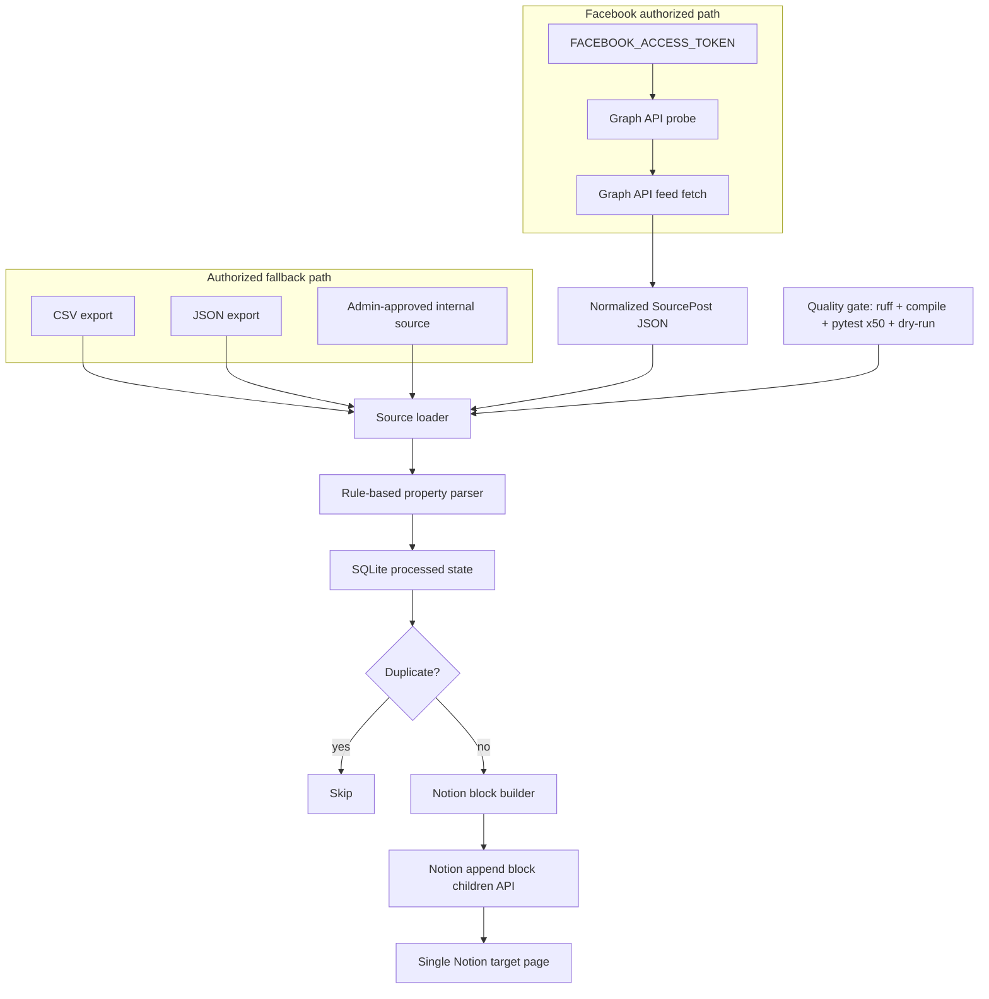

# Architecture

This project records property posts into a single Notion page through a stable, authorized pipeline.

It does **not** automate a logged-in browser, spoof a human, bypass CAPTCHA, replay cookies, or work around platform rate limits. Stability is achieved through official APIs where available, authorized CSV/JSON fallbacks, idempotent state, conservative retries, and observable JSON artifacts.

## System overview

## Components

| Component | File | Purpose |
| --- | --- | --- |
| CLI | `src/fb_notion_property_logger/cli.py` | Commands for probe, fetch, sync, and pipeline |
| Facebook API adapter | `src/fb_notion_property_logger/facebook_api.py` | Official Graph API probing/fetching with retry and paging |
| Source loader | `src/fb_notion_property_logger/source.py` | CSV/JSON normalization into `SourcePost` |
| Parser | `src/fb_notion_property_logger/parsers.py` | Extracts price, location, station, layout, size, and features |
| State store | `src/fb_notion_property_logger/state.py` | SQLite duplicate prevention |
| Notion client | `src/fb_notion_property_logger/notion.py` | Appends blocks to one Notion page |
| Quality gate | `scripts/quality_gate.sh` | Objective checks including 50 pytest repetitions |

## Data flow

1. `probe-facebook` checks whether the supplied group ID can be reached through Graph API using `FACEBOOK_ACCESS_TOKEN`.
2. `fetch-facebook` requests the feed with paging if the token and permissions allow it.
3. If Graph API cannot retrieve the group feed, operators provide authorized `posts.json` or `posts.csv`.
4. `sync` normalizes posts, extracts real-estate fields, checks SQLite for duplicates, and appends new records to the Notion page.
5. Every dry-run and quality check writes JSON artifacts under `out/`.

## Failure behavior

- Missing Facebook token: exits with code 2 and writes a probe report.
- Graph API denied or removed: writes the exact HTTP status and response body to the probe/fetch output.
- Missing Notion credentials: exits before sending data unless `--dry-run` is used.
- Duplicate post URL: skipped via SHA-256 stable key.
- Too many Notion blocks: automatically split into batches of 100 blocks per request.

## Stability strategy

- No brittle browser DOM automation.
- No dependency on UI timing, scroll behavior, cookies, or screenshots.
- API calls use bounded retries on retryable status codes only.
- All live data paths produce replayable JSON.
- Tests mock external services, so CI is deterministic.
