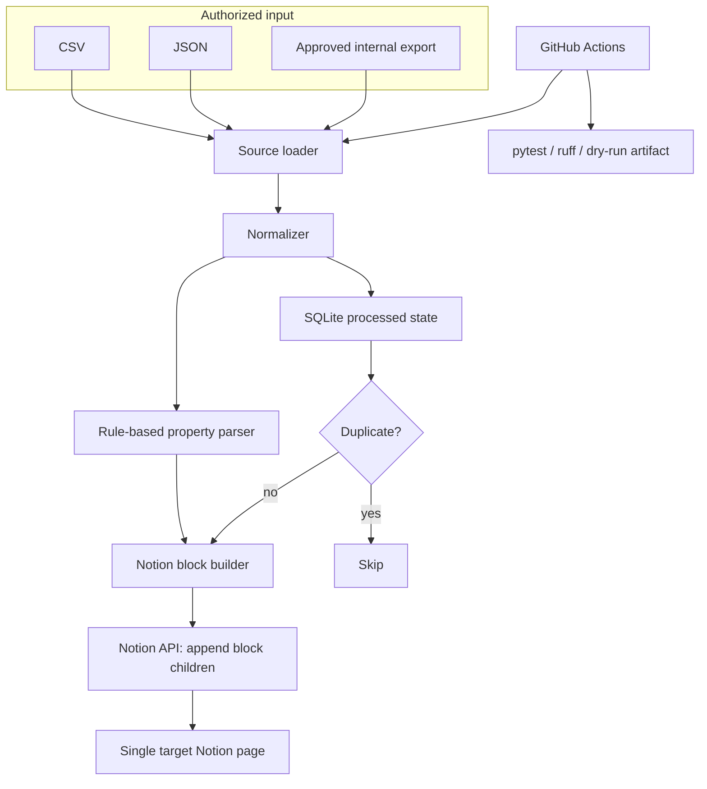

# Architecture

このプロジェクトは、Facebookグループ画面を自動操作するスクレイパーではありません。許可済みのCSV/JSONを入力にし、Notionの単独ページへ物件投稿を追記する同期パイプラインです。

## Components

## Data flow

1. `source.py` がCSV/JSONを読み込みます。
2. `models.SourcePost` に正規化します。
3. `state.ProcessedStore` が投稿URL由来のハッシュで重複を判定します。
4. `parsers.py` が物件情報を簡易抽出します。
5. `notion.py` がNotion block payloadを作成します。
6. `NotionClient.append_to_page()` が `PATCH /v1/blocks/{page_id}/children` を呼びます。
7. 成功後、SQLiteに処理済みキーを保存します。

## Security and compliance posture

- Facebookログイン、Cookie、セッション、2FA、CAPTCHAを扱いません。
- ブラウザ自動化や検知回避を行いません。
- SecretsはGitHub Secretsまたはローカル環境変数で管理します。
- Notion tokenはリポジトリに保存しません。
- 入力ファイルはユーザーが取得権限を持つデータだけを置く前提です。

## Production requirements

| Item | Required | Purpose |
| --- | --- | --- |
| `NOTION_TOKEN` | yes | Notion API authentication |
| `NOTION_PAGE_ID` | yes | Target single page to append records |
| CSV/JSON source | yes | Authorized post data input |
| GitHub Actions schedule | optional | Periodic sync |
| SQLite state file/cache | recommended | Duplicate prevention |

## Extension points

- `source.py` に別の許可済み入力アダプタを追加できます。
- `parsers.py` の正規表現を地域・物件種別ごとに拡張できます。
- Notion databaseへ行として保存するモードを追加できます。
- Slack/メール通知を同期完了時に追加できます。
